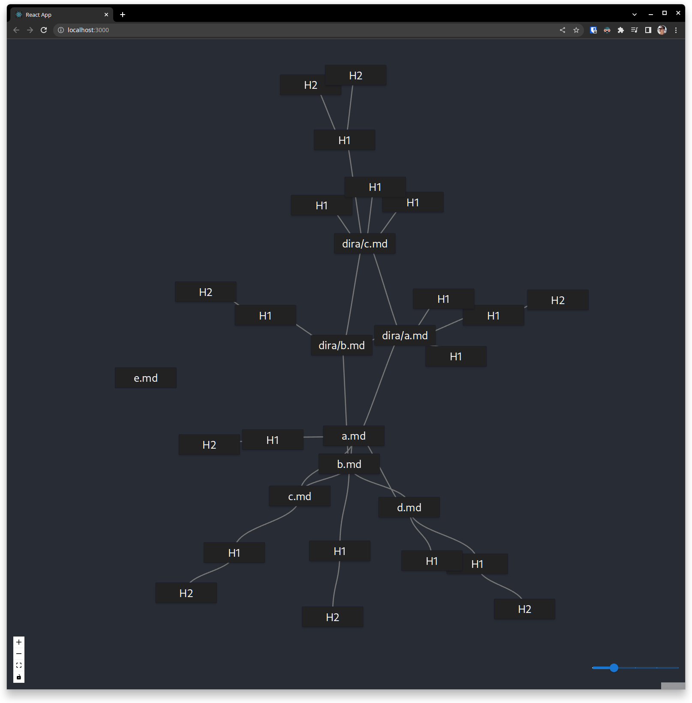

# Mind Map Markdown

This is a tool to convert markdown files to a realtime mind map. Markdown has become the ubiquitous format for writing notes. This tool allows you to visualize your notes in a mind map format. It is a tool to help you organize your thoughts and ideas. Speaking for myself, whenever I write something down, I end up not using it again. I hope that with this tool I become a bit more disciplined and use my notes more often.

## Features (ToDo)

I want to version this project's planning along with its sources as an experiment. It seems like a good idea to be using it as a test bed.

Let's jot done some unrefined ideas:

- [x] Add basic usage and setup instructions.
- [ ] Enrich CI with format and lint checks (yes procrastinating the next "feature").
- [ ] TDD or die (I normally don't do it because if feels like a huge energy drain).
- [ ] Open markdown file when you click on the corresponding node in the mind map.
- [ ] Acceptable theme for the mind map.
- [ ] Some layout controls for the mind map.
- [ ] Maybe make a plugin for VSCode to make it easier to use.
- [ ] Maybe use electron or heck go native. I love KDE so maybe a KDE app.
- [ ] Maybe support serialization of the mind map to github compatible format.

## Usage

### Backend

```bash
cd backend
python -m venv venv
. ./venv/bin/activate
pip install -r requirements.txt
python app.py --root-dir=$PWD/../docs/example
```

### Frontend

```bash
cd frontend
yarn
yarn start
```

Your default browser should show the mind map:


## CI

I opted to use [pre-commit](https://pre-commit.com/) instead of a github pipeline for now because it seems my runner would be exposed for repo forks for instance. I haven't looked into it yet.

Anyway to use git hooks you need to install the pre-commit package:

```bash
pip install pre-commit
pre-commit install
# et voila
```
